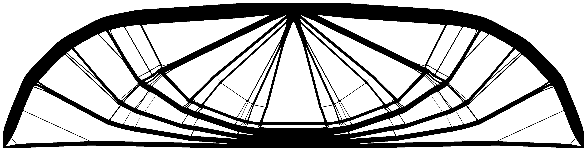

# BESOneo2
A fast and efficient BESO topology optimization function for 2D minimum compliance topology optimization subject to a volume constraint.

## About

2D Bi-Directional Evolutionary Topology Optimization (BESO) for computing an optimal minimum compliance structure subject to a given volume constraint. BESO is based on the code by [Huang, X., & Xie, Y. M. (2010)](https://doi.org/10.1002/9780470689486), and significant speedups are realized through reduced indexing and efficient matrix construction as detailed in [Ferrari, F., & Sigmund, O. (2020)](https://doi.org/10.1007/s00158-020-02629-w).

## Getting Started

A basic cantilever example can be called using
`[x, obj] = BESOneo2(400,200,0.3,0.02,3,"cantilever");`
Problem definitions for a cantilever, frame reinforcement problem ([Ferrari, F., & Sigmund, O. (2020)](https://doi.org/10.1007/s00158-020-02629-w)), L-bracket, Messerschmitt–Bölkow–Blohm (MBB) beam and a cantilever with non-designable region are included in `predefinedStructure.m`. Additional problem definitions can be appended to the `predefinedStructure` function or section D in `BESOneo2` replaced for custom definitions.

### Inputs
Parameter | Description
--------|-------
`nx` `ny` | design domain size in the x & y direction
`volfrac` | volume constraint where *0 < `volfrac` <= 1*
`er` | Evolutionary rate
`rmin` | Sensitivity filter radius to solve mesh dependency issues
`definition` | Problem definition

### Features

Specification of non-design regions can be achieved by adding elements to the `pasS` and `pasV` sets in code section C. This will exclude the specified elements from the optimization process and set them permanently as solid or void elements.

Edge conditions can be specified individually for any number of edge segments. Conditions are applied in the following order: periodic and symmetric -> load replicate -> displacement constraint replicate -> free/zero conditions.

#### Example: Non-designable region
Define `pasV` in section C as:
```matlab
    [cx, cy, cr] = deal(nx/2, ny/2, ny/3);
    [dy, dx] = meshgrid(1:nx, 1:ny);
    ndr = sqrt((dx-cy).^2+(dy-cx).^2) < cr;
    pasV = find(ndr);
```
Calling BESOneo2 with `[x, obj] = BESOneo2(800,400,0.3,0.02,8,"cantilever_ndr")` results in:


## Dependencies

BESOneo uses the fast sparse matrix construction routine `fsparse` [Engblom, S., & Lukarski, D. (2016)](https://doi.org/10.1016/j.parco.2016.04.001) which is downloadable from the first authors GitHub page at: https://github.com/stefanengblom/stenglib.
Alternately, the code can be run without dependencies by changing all `fsparse` calls to MATLABs inbuilt `sparse` function.

## References

Huang, X., & Xie, Y. M. (2010). Evolutionary Topology Optimization of Continuum Structures: Methods and Applications. https://doi.org/10.1002/9780470689486

Ferrari, F., & Sigmund, O. (2020). A new generation 99 line Matlab code for compliance Topology Optimization and its extension to 3D. https://doi.org/10.1007/s00158-020-02629-w

Engblom, S., & Lukarski, D. (2016). Fast Matlab compatible sparse assembly on multicore computers. Parallel Computing, 56, 1–17. https://doi.org/10.1016/j.parco.2016.04.001
